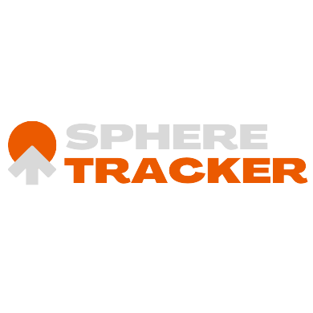

<!-- Insert logo here -->
<div align="center">
    
</div>

# sphere tracker
Track spherical objects in videos. Includes fish eye camera calibration and object tracking.

# Demo

<!-- Insert gif of output video  -->
<div align="center">
  
  
</div>


# Install
Required python libraries
- cv2, numpy, argparse, os, random, sys, glob

# Usage
```
python pixel_diff.py --i input/sphero1_1080.mp4
```
Check pixel_diff.py for more argument options

### Sources 
Code based on paper:
- "Moving Object Detection and Segmentation using Frame differencing and Summing Technique - Thapa, Sharma, Ghose”

Calibration based on:
- 
- 